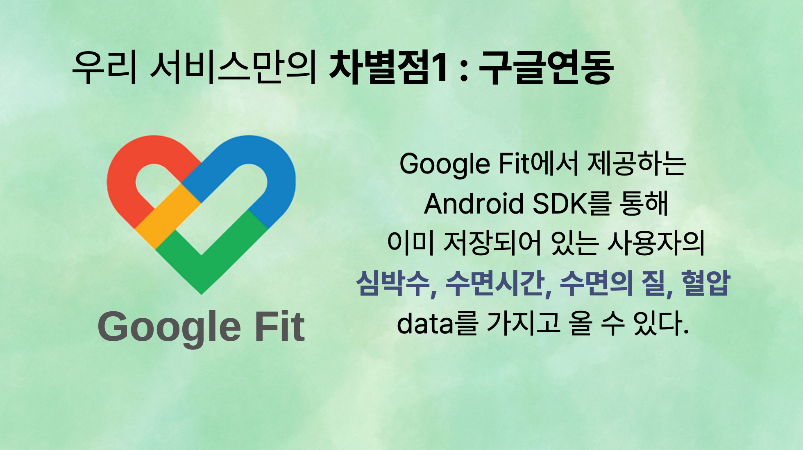

# 당신의 소중한 기억들을 위해 : 아차차💡

> '아차차'는 사용자의 구글 헬스 데이터, 식습관, 검사 결과를 바탕으로 치매 위험도를 예측하는 서비스입니다.


## 프로젝트 소개
- 
- 

### 기획 배경

최근 조사 결과에 따르면 성별과 연령별 추정치매 환자 수가 증가하고 있습니다. 
특히 65세 이상의 치매 환자 수가 주목할 만한 증가 추세를 보이고 있습니다. 
2020년에는 65세 이상의 치매 환자 수가 전체 환자 중 10%를 차지했으나, 2050년에는 이 수치가 16%로 상승할 것으로 예상됩니다. 이는 약 302만 명에 해당하는 인구 수를 의미합니다.


치매는 크게 알츠하이머와 혈관성 치매로 분류됩니다. 
알츠하이머는 인지능력 저하로 발병하는 질환으로, 진단과 치료가 어려운 특징이 있습니다. 
그러나 혈관성 치매는 건강 기록만으로도 진단하고 예방할 수 있는 점이 있습니다. 
따라서 우리는 혈관성 치매에 주목하여 해당 프로젝트를 기획하였습니다.

치매를 초기에 발견하면 조기 약물 치료와 체계적인 관리를 통해 치료 비용을 절감하고 치료 효과를 극대화할 수 있습니다.

### 기존 치매관련 헬스케어 제품
1. 치매 체크

2. 실비아


### '아차차' 만의 차별점
- 안정 시 심박수 (RHR)
- 고혈압 환자의 혈압
- 전체 수면 대비 REM 수면의 비중

위의 데이터를 기준으로 치매 위험도를 크게 `건강`, `주의`, `위험`으로 분류하였습니다.


Google Fit의 Android SDK를 사용하여 이미 저장되어 있는 사용자의 심박수, 수면시간, 수면의 질, 혈압 data를 가지고 올 수 있습니다.
이를 통해 사용자가 건강 관련 데이터를 직접 입력해야 하는 번거로움을 덜 수 있으며,
실시간으로 제공되는 정보를 활용하여 빠른 진단을 수행할 수 있습니다.


구글 피트니스와의 연동을 통해 받은 데이터를 활용하여 매일 자동으로 치매를 예측해주는 서비스를 제공합니다. 
이를 통해 주요 대상층으로 설정되어있는 60세 이상의 노인분들이 기존의 서비스를 최대한 활용할 수 있도록 하였습니다.


## 👩🏻‍💻팀원 소개

| 분야  | 이름  | 포지션 |
|-----|-----|-----|
| 기획, 개발 | 최유빈 | 서비스 기획, Android 개발 담당 |
| 개발  | 김세환 | 서버 개발 담당 |
| 개발  | 이영선 | 서버 개발 담당 |

## 개발
### 기술 스택
- **안드로이드**
  - 
- **서버**
  - 
  
  - 
    
    
    
  - 
    
- **협업 툴**
  - 
    

### 시스템 아키텍처

### ✅ Commit Convention

| Type | Description |
| --- | --- |
| feat | 신규 기능 구현 작업 |
| fix | 버그 수정 |
| refactor | 리팩토링 작업 |
| docs | 문서화 관련 작업 |
| style | 코드 스타일 관련 작업 |
| rename | 변수/클래스/메서드 명 변경 |
| chore | for other operations commit |
- 예시

```
[feat] 소셜 로그인 기능 구현
[refactor] memberService 리팩토링
[docs] 소셜 로그인 스웨거 설정
[fix] 만료된 토큰 요청 시 검증 안하는 문제 수정
[style] 주석 제거
[rename] "memberInfoDto" 를 "memberInfoRequest" 으로 변경
[chore] h2 의존성 추가
```

## 🧱 Git flow


| 브랜치명    | 설명                               | 
|---------|----------------------------------|
| main    | 라이브 서버에 제품으로 출시되는 브랜치.           |
| develop | 다음 출시 버전을 대비하여 개발하는 브랜치.         |
| feature | 추가 기능 개발 브랜치. develop 브랜치에 들어간다. |
| fix     | main 브랜치에서 발생한 버그를 수정하는 브랜치.     |

- 예시
  ```
  feature/sleep-api
  fix/login
  ```
